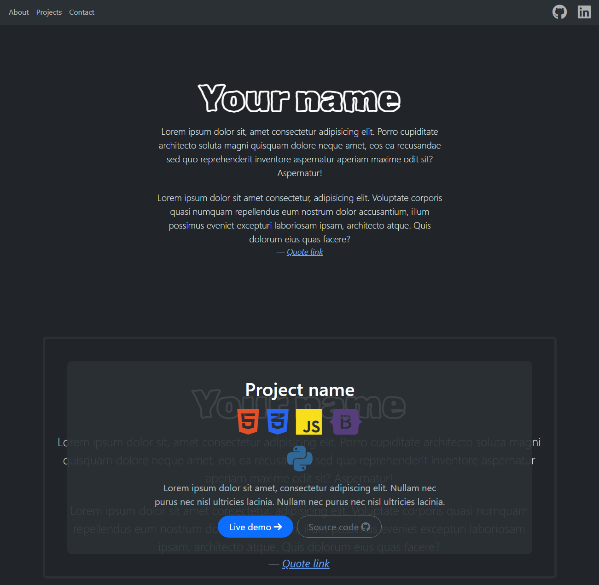

# Portfolio page template

## Description

This is a simple portfolio page template designed to showcase your projects. It features a responsive design with a navigation bar, a hero section with a quote, a projects section, and a contact details section. The template is built primarily using ready [Bootstrap elements](https://getbootstrap.com/docs/5.3/examples/).

## Used Technologies

- HTML5: Used for structuring the content of the web page.
- CSS3: Used for styling the web page.
- JavaScript ES6: Used for adding interactivity to the web page.
- Bootstrap v5.3.3: Used for layout and styling.
- Font Awesome V6: Used for adding icons to the web page.
- Google Fonts: Used for typography. Specifically, the Rubik Scribble font is used.

## Installation and Setup

1. Clone the repository
2. Customize the template
3. Deploy

## Usage

Here's how you can use this template to showcase your own projects:

In `index.html`:

- Replace the placeholder Font Awesome kit URL in line 14 with your own. More info on kits [here](https://docs.fontawesome.com/web/setup/use-kit/).
- Replace the hero quote with your own.
- In the projects section, replace the placeholder content with your own projects. You can add as many project cards as you want by copy & pasting the project card. You can customize the project cards by changing the background image in the style tag and by changing the icons in the icon shelf.
  - To add new icons simply add them to the icon tag to the desired Icons shelf. Also add the color for the icon to the `style.css` and add the class to the icon tag.
- In the contact details section, replace the placeholder content with your own contact details.

## Contributing

This is a personal project, so not accepting pull requests, but feel free to fork it and use it for your own portfolio!

## License

This project is licensed under the MIT License.

## Contact

If you have any questions or comments about this project, feel free to connect with me on [LinkedIn](https://www.linkedin.com/in/eemil-ikonen-508142201/).
